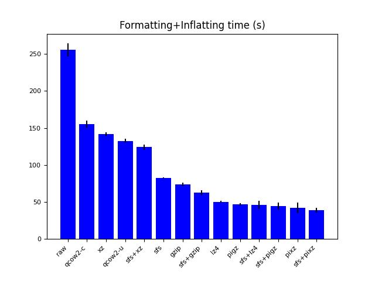
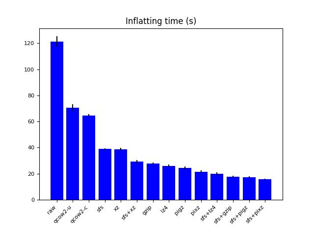
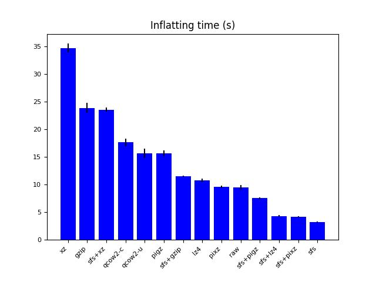
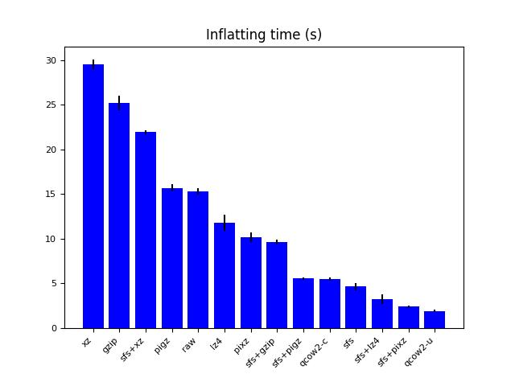
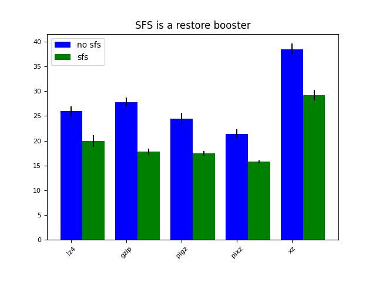

Benchmark
=========


# Description

We compare different backup/restore approaches and their perfomances. The different benchmarks use varying backup sources and destinations. We show that sparse-file-stripper, just like any other, is only suited for some situations, depending on whether your backup source is a drive, a filesystem, and your backup storage is fast or slow

## Bench 1

We save a block area - /dev/nvme1n1p1 - (some block device that supports hole punching or zeroing a whole range at the block level, for example thanks to RZAT=Read Zero After Trim) to a slow destination (nfs storage located far away from source) and restore it. This matches to a use case where the backup source is a fast block device, while the backup destination is slow to ingest data.

## Bench 2

We save the block area /dev/nvme1n1p1 to /tmp/tmpfs/backup.img and restore it. This matches to a use case where both the backup source and backup destination are fast.

## Bench 3

We also compare performances with files on a filesystem supporting hole punching (ext4 in our case).

## Bench 4

What if the device we want to backup is slow and supports hole punching (like a remote iscsi target) ? Let's find out with this bench (available on hardware config 2 only). Backup destination is a slow nfs filesystem.

# Conditions

We ran the drive backup/restore benchmarks using two distinct hardware configurations:

## Config 1

- Cpu: Intel(R) Xeon(R) CPU E5-2687W v4 @ 3.00GHz (2 sockets x 12 cores x 2 threads, important info to understand pigz/pixz performances, respectively parallel gzip and parallel xz implems)
- Ram: Samsung M393A4K40BB2-CTD ram 32G banks, 2633 MHz (total 256G, though the total amount does not really matter)
- Drive: INTEL SSDPE2MX450G7, nvme 450G (unregistered firmware version :(, that would matter, see notice just below)

Important notice: at the time we ran the benchmark with this config, back in 2019, on a 4.x (>4.9) kernel, the drive supported fallocate(FALLOC_FL_PUNCH_HOLE | FALLOC_FL_KEEP_SIZE) calls, meaning there
was some mechanism to perform instant zeroing on it. When coming back in 2022 on the same drive model, no matter which kernel version (>4.9) we choose, the call is not supported anymore.
Our tool's performances (as well as qemu-img's) are consequently heavily impacted when restoring a backup.

Digging in the kernel sources, we saw that the criterion evolved between 4.9 and 5.18+, telling whether the REQ_OP_WRITE_ZEROES is supported by a given block device or not.
Still, as written, no matter whether we rolled back to an older kernel or not the hole_punching did not seem supported anymore. The only explanation we see is that the feature was somehow
removed after a firmware upgrade on the drive, which we keep up to date on a regular basis. You can quickly check if your drive will allow you to benefit from the optimal backup/restore:

```
$> cat /sys/class/block/<device>/queue/write_zeroes_max_bytes
```

If the file does not exist or contains 0, then you won't :(

We keep the benchmark because it still records the performance boost on restore, provided your hardware supports some instant zeroing mechanism (something like RZAT for nvme).
Besides, the benchmark is still interesting because it shows the tool can also be used to boost classical compression tools.


## Config 2

- Cpu: Intel(R) Xeon(R) E-2274G CPU @ 4.00GHz (1 sockets x 4 cores x 2 threads)
- Ram: 2 16GiB DDR 4 2666 MHz banks (ref: HMA82GU7CJR8N-VK) (total 32G, though the total amount does not really matter)
- Drive:
    - For benchmarks 1, 2, 3: loop device on top of a filesystem supporting hole punching. Not ideal, of course. We did so to emulate some fast hardware block device supporting hole punching (we had none at hand). What matters for the emulation to be meaningful is that hole punching on the entire drive is faster than explicit zeroing.
    - For benchmark 4: iscsi remote target, the backend storage is a nvme drive (SAMSUNG MZQLB960HAJR-00007 960 GB), iperf between initiator and target gives a 9.2Gbps bandwidth

# Prepare benchmark

```
$> cd /tmp
$> apt-get update -y && apt-get install -y qemu-utils pigz pixz liblz4-tool virtualenv bc
$> virtualenv /tmp/benchmark1
$> source /tmp/benchmark1/bin/activate
$> pip install numpy pandas matplotlib
$> wget -O image1.qcow2 https://cloud-images.ubuntu.com/focal/current/focal-server-cloudimg-amd64.img
$> qemu-img convert -O raw -f qcow2 image1.qcow2 image1.raw
$> qemu-img resize image1.raw +2G
```

If you take a look at this image, you can see that it matches to a 35% used 4.2G drive (once resized).

Now, you can run the benchmark by relocating image1.raw anywhere (filesystem, tmpfs , drive, drive partition)

In our case, to accelerate our bench and avoid making full drive backups/restore everytime, we created an intermediate partition that we used to simulate a smaller drive.

We ran:

```
# Only erase partition table if you do not care about your physical drive data
# $> sgdisk -Z /dev/nvme1n1

# Adapt drive path and partition number to your setup (/dev/nvme1n1 in our case)
# $> sgdisk -n 1::+$(echo "$(ls -al /tmp/image1.raw | awk '{print $5}') / 2^10" | bc)K -t 1:83 /dev/nvme1n1
# $> cat /tmp/image1.raw > /dev/nvme1n1p1
```

# Script

[bench.sh](bench.sh)


# Results

## [Hardware config 1](hardware_config1)

## [Hardware config 2](hardware_config2)


## Sum up

As all the benchmarks tend to show, combining sparse-file-stripper with other compression tools will boost file restore at the cost of a variable overhead during the compression step (which could probably be decreased, though not suppressed, by optimizing our current code).

Thus, if you're more interested in the compression step than the restore one, it's useless to use it.

[bench1](hardware_config1/bench1) tends to show that the stripper gets more interesting if your backup destination storage is slow (common cold storage use case). In such a case, the overhead of the stripper during the formatting step tends to be lighter, while the inflate/restore boost is more important.

As soon as the backup destination storage gets warmer, the overhead during the compression step gets bigger. In our specific example ([bench2](hardware_config1/bench2)), keeping the raw uncompressed file got the best results and lz4 got the better results after raw if we consider the total time (backup + restore). So in such a case, it may not be useful to waste time compressing (if you're not worried about storage volume) or stripping common patterns before that. Unless you're more interested in the restore time, for which the sparse-file-stripper still proves to be a booster even in such a scenario.

In the last scenario ([bench3](hardware_config1/bench3), file backup/restore on a filesystem supporting hole_punching), the sparse-file-stripper gets close to qemu-img regarding performances, with the additional benefit that you can stream the output.

Notice: with the first config we did not run the dd+sparse approach, which we added later, but we had no such hardware config like the first one at hand anymore.


### Backup + Restore total time

#### Cold backup storage



### Restore performances on drive

#### Cold backup storage



#### Warm backup storage



#### Filesystem



### Sparse-file-stripper usage as a compression tool booster



# Conclusion

Sparse-file-stripper is like a lot of imaging and compression tools: not suited for all situations.

It really gets interesting in any of the following:
  - if the drive you are saving is not full, and it supports any technology allowing for hole_punching or zero_ranging to benefit from optimal performances when restoring.
  - if the file you are formatting is sparse and the filesystem you intend to restore it onto supports hole_punching.
  - if you do not have many cpus, or if they are slow (creating a bottleneck at the (un)compression step).
  - if your backup storage solution is slow.
  - if you want to boost the restore time of advanced compression tools.
  - if you want something close to inflate performances of qemu-img with a streamable workflow.
